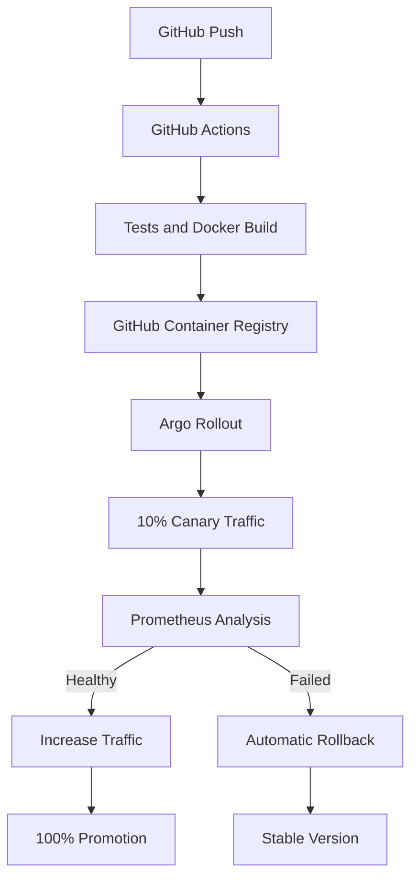

<div align="center">

# 🚦 Intelligent Canary Deployment & Automated Rollback

### Kubernetes progressive delivery using Argo Rollouts, Prometheus and GitHub Actions


<br/>

[](https://github.com/hemantsharma2189/intelligent-canary-deployment/actions/workflows/canary-pipeline.yml)

</div>

---

## 📌 Project Overview

This project demonstrates a Kubernetes canary deployment workflow that gradually shifts traffic to a new application version while monitoring availability, HTTP success rate, latency and container health.

Argo Rollouts pauses or automatically rolls back a release when Prometheus metrics exceed configured failure thresholds. GitHub Actions tests the application, builds and publishes a Docker image, and generates an evidence-based explanation for rollout decisions.

## ✨ Key Features

- Progressive traffic shifting at 10%, 25%, 50%, 75% and 100%
- Automated Prometheus analysis during rollout
- Automatic rollback on failed success-rate or latency checks
- NGINX Ingress traffic routing
- Stable and canary Kubernetes Services
- Liveness and readiness probes
- CPU and memory requests and limits
- Prometheus application metrics
- Automated application and rollout tests
- Docker image publishing to GitHub Container Registry
- Evidence-based and optional AI-assisted rollout explanations

## 🏗️ Architecture



## 📁 Project Structure

```text
intelligent-canary-deployment/
├── .github/
│   └── workflows/
│       └── canary-pipeline.yml
├── app/
│   ├── app.py
│   └── requirements.txt
├── examples/
│   └── failed-rollout.json
├── kubernetes/
│   ├── analysis-template.yaml
│   ├── ingress.yaml
│   ├── rollout.yaml
│   └── service.yaml
├── scripts/
│   └── rollout_explainer.py
├── tests/
│   ├── test_app.py
│   └── test_rollout_explainer.py
├── Dockerfile
├── LICENSE
└── README.md
```

## 📊 Application Metrics

The sample application exposes:

```text
canary_http_requests_total
canary_http_request_duration_seconds
```

Endpoints:

| Endpoint | Purpose |
|---|---|
| `/` | Application response and version |
| `/health` | Kubernetes liveness probe |
| `/ready` | Kubernetes readiness probe |
| `/metrics` | Prometheus metrics |

## 🎯 Canary Strategy

| Stage | Traffic weight | Validation |
|---|---:|---|
| Initial | 10% | 60-second pause |
| Analysis 1 | 25% | Prometheus success rate and latency |
| Analysis 2 | 50% | 120-second pause and Prometheus analysis |
| Expansion | 75% | 120-second observation |
| Promotion | 100% | Full release |

## 🚨 Automated Rollback Thresholds

The rollout analysis fails when:

```text
Success rate < 95%
P95 latency >= 0.5 seconds
Failure limit = 2 measurements
```

When the failure limit is reached, Argo Rollouts stops the canary and returns traffic to the stable version.

## ▶️ Run the Application Locally

Clone the repository:

```bash
git clone https://github.com/hemantsharma2189/intelligent-canary-deployment.git
cd intelligent-canary-deployment
```

Build the image:

```bash
docker build -t canary-app .
```

Run the stable version:

```bash
docker run --rm -p 8080:8080 \
  -e APP_VERSION=v1-stable \
  -e FAILURE_RATE=0 \
  canary-app
```

Test it:

```bash
curl http://localhost:8080/
curl http://localhost:8080/health
curl http://localhost:8080/metrics
```

## 🧪 Simulate a Failed Canary

Run a version with a 20% simulated failure rate:

```bash
docker run --rm -p 8080:8080 \
  -e APP_VERSION=v2-canary \
  -e FAILURE_RATE=0.20 \
  canary-app
```

This generates HTTP 500 responses that Prometheus can detect during rollout analysis.

## ☸️ Kubernetes Prerequisites

- Kubernetes cluster, Kind or Minikube
- `kubectl`
- Argo Rollouts controller
- NGINX Ingress Controller
- Prometheus

Apply the resources:

```bash
kubectl apply -f kubernetes/service.yaml
kubectl apply -f kubernetes/ingress.yaml
kubectl apply -f kubernetes/analysis-template.yaml
kubectl apply -f kubernetes/rollout.yaml
```

Monitor the rollout:

```bash
kubectl argo rollouts get rollout canary-app --watch
```

## 🧠 Rollout Decision Explanation

Generate an evidence-based explanation for the included failed rollout:

```bash
python scripts/rollout_explainer.py \
  examples/failed-rollout.json \
  --output rollout-explanation.md
```

The report includes:

- Application version
- Rollout status
- Observed success rate
- P95 latency
- Promotion, pause or rollback decision
- Supporting evidence

If `AI_API_KEY` is configured, an optional AI-generated explanation is added. The AI does not execute deployment changes.

## ✅ Automated Tests

Install dependencies:

```bash
pip install -r app/requirements.txt
```

Run tests:

```bash
python -m unittest discover -s tests -v
```

## 🔄 GitHub Actions Pipeline

The workflow automatically:

- Installs Python dependencies
- Runs application and rollout-explanation tests
- Builds the Docker image
- Verifies health, readiness and metrics endpoints
- Generates a failed-rollout explanation
- Publishes reports as workflow artifacts
- Pushes versioned images to GitHub Container Registry

## 🔐 Safety Controls

- No credentials are stored in source code
- GitHub uses the built-in short-lived workflow token
- Container runs as a non-root user
- Kubernetes health probes validate releases
- Resource requests and limits are configured
- Failed canaries return traffic to the stable version
- AI explanations never execute deployment actions

## 👨‍💻 Author

**Hemant Sharma**

Cloud & DevOps Engineer focused on AWS, Terraform, Kubernetes, GitOps, CI/CD and cloud security.

[LinkedIn](https://www.linkedin.com/in/hemantsharma20/) •
[GitHub](https://github.com/hemantsharma2189) •
[Portfolio](https://hemantsharma2189.github.io/)

---

<div align="center">

⭐ Star this repository if you find it useful.

</div>
